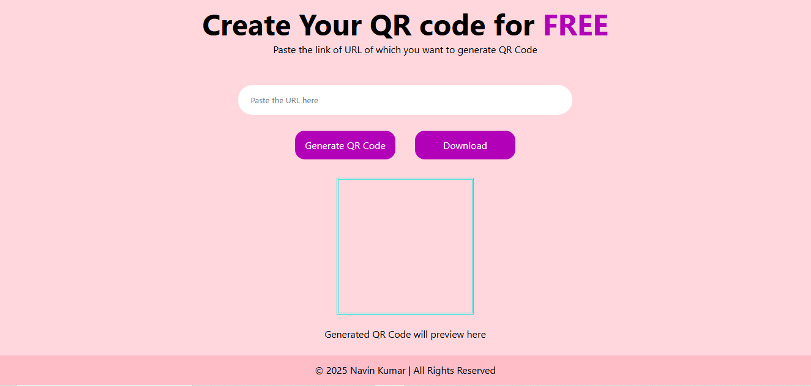
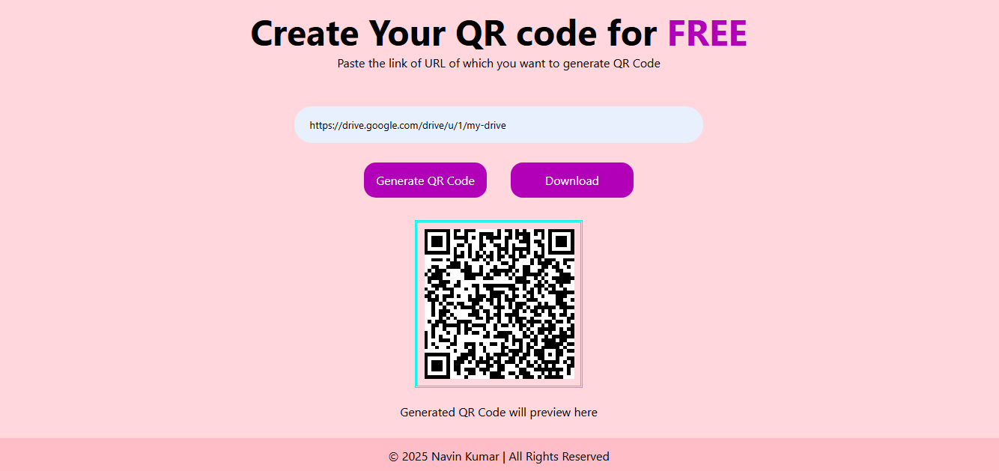

# 🚀 QRCodeX

> A fast, free, and user-friendly QR code generator made using HTML, CSS, and JavaScript.


---

## 🌐 Live Demo

🔗 [Visit QRCodeX](https://qrcodex-navin.netlify.app/)

---

## 📸 Screenshots

### 🖼️ Home Page



### 🖼️ QR Code Generated



---

## 📦 Features

* 🔗 Generate QR codes for any valid link
* 👁️ Preview the QR code instantly
* 📥 Download the QR code as an image
* ⚡ 100% free and lightning fast
* 🎨 Simple, clean, and responsive UI

---

## ⚙️ Tech Stack

* HTML5
* CSS3
* JavaScript (Vanilla)

---

## 📥 How to Use

1. Paste your link in the input box.
2. Click **"Generate QR Code"** to see the preview.
3. Click **"Download"** to save the QR code image.

---

## 📂 Folder Structure

```bash
QRCodeX/
│
├── index.html            # Main HTML file
├── style.css             # Styling for the app
├── qr-code.png           # Favicon icon
├── home.png              # Screenshot of homepage
├── qr-output.png         # Screenshot of generated QR
├── README.md             # Project documentation
└── LICENSE               # MIT License
```

---

## 👨‍💻 Author

**Navin Kumar**

* [💼 LinkedIn](https://linkedin.com/in/geekynavin)
* [🐱 GitHub](https://github.com/geekynavin)
* [📫 Email](mailto:navin.sarni@gmail.com)

> Designed and Developed with ❤️ by Navin Kumar.

---

## 📃 License

This project is licensed under the [MIT License](./LICENSE).
